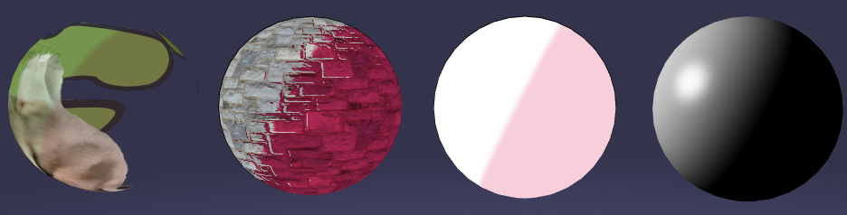

# @m-yamagishi/babylon-mtoon-material

[](https://github.com/semantic-release/semantic-release) [](https://opensource.org/licenses/MIT) [](http://commitizen.github.io/cz-cli/)



Port of [VRMC_materials_mtoon-1.0](https://github.com/vrm-c/vrm-specification/tree/master/specification/VRMC_materials_mtoon-1.0) to [Babylon.js](https://www.babylonjs.com/) WebGL/WebGPU.

NOTE: Some settings will be ignored or generates inconsistent lighting.

[About MToon](https://vrm.dev/univrm/shaders/shader_mtoon/)

## Features

- Lit Color(Texture) and Shade Color(Texture)
- Toony factor
- Rim lighting
- Matcap lighting
- Outline Renderer
- UV Animation(X/Y/Rotation)

## Usage

This material will be automatically assigned to VRM/VCI model within [babylon-vrm-loader](https://github.com/il-m-yamagishi/babylon-vrm-loader).

Also you can explicitly assign MToonPluginMaterial to any materials.

### Browser

TODO

### npm

```s
$ npm install --save @babylonjs/core @m-yamagishi/babylon-mtoon-material
```

### Build

```s
$ npm ci
$ npm run build
```

### Debugging MToonPluginMaterial

```s
$ npm ci
$ npm run dev
```

It runs vite dev server on localhost:5173.

### Test

```s
$ npm ci
$ npm test
```

## Related Links

- [BabylonJS/Babylon.js: Babylon.js: a complete JavaScript framework for building 3D games with HTML 5 and WebGL](https://github.com/BabylonJS/Babylon.js)
- [vrm-c/UniVRM: Unity package that can import and export VRM format](https://github.com/vrm-c/UniVRM)
- [Create a Material For The Material Library | Babylon.js Documentation](https://doc.babylonjs.com/divingDeeper/developWithBjs/matForMatLibrary)
- [Introduction To Materials | Babylon.js Documentation](https://doc.babylonjs.com/divingDeeper/materials/using/materials_introduction)
- [Material Plugins | Babylon.js Documentation](https://doc.babylonjs.com/features/featuresDeepDive/materials/using/materialPlugins)
